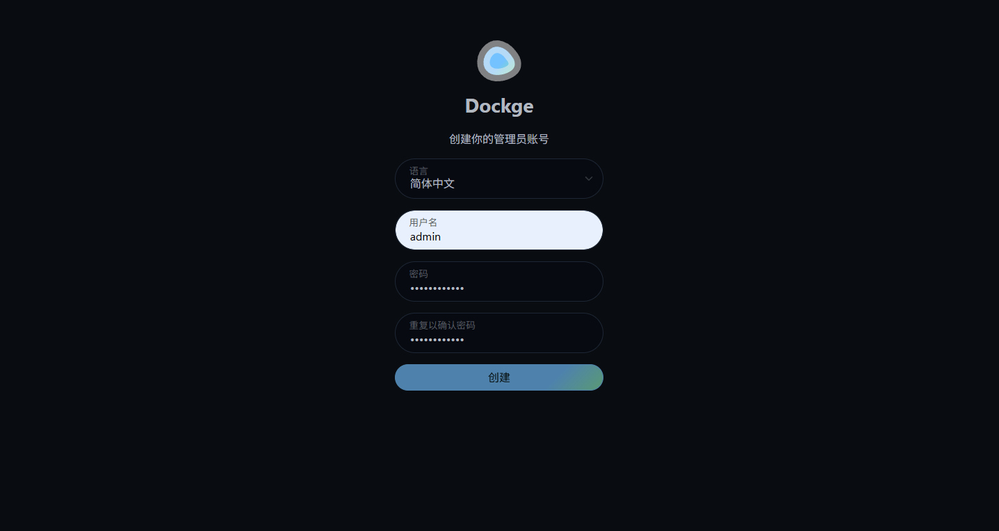
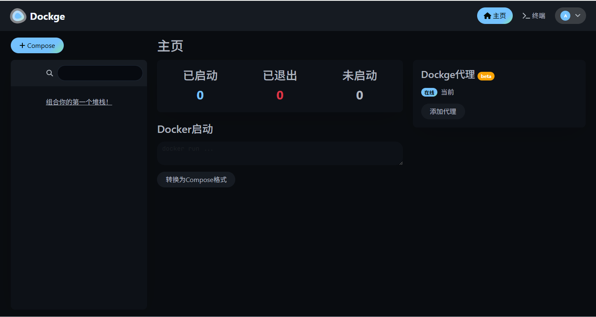

# Dockge 可视化管理工具

Dockge是一款界面炫酷、易于使用的Docker Compose可视化管理工具。

Dockge具有如下特性：
* 具有compose.yaml文件管理功能，支持容器的Create/Edit/Start/Stop/Restart/Delete操作，并支持更新镜像。
* 具有交互式的compose.yaml编辑器。
* 具有交互式的Web终端功能。
* 能将docker run命令自动转化为compose.yaml脚本。
* 支持响应式输出，任何信息都能实时输出。
* 具有简单易用的功能和炫酷的UI界面。

## 安装
使用Docker来安装Dockge非常方便，我们将采用此种方式

* 首先通过如下命令下载Dockge的镜像
```shell
docker pull louislam/dockge:1
```
* 下载完成后通过如下命令运行Dockge的容器
```shell
docker run -p 9999:5001 --name dockge \
-e "DOCKGE_STACKS_DIR=/opt/stacks" \
-e "DOCKGE_ENABLE_CONSOLE=true" \
-v /var/run/docker.sock:/var/run/docker.sock \
-v /opt/dockge/data:/app/data \
-v /opt/dockge/stacks:/opt/stacks \
-d louislam/dockge:1
```
或使用Docker compose运行
```yml
version: "3.8"
services:
  dockge:
    image: louislam/dockge:latest
    container_name: dockge
    restart: unless-stopped
    ports:
      - 5031:5001
    volumes:
      - /var/run/docker.sock:/var/run/docker.sock
      - /opt/dockge/data:/app/data
      - /opt/dockge/stacks:/opt/stackss
    environment:
      - DOCKGE_STACKS_DIR=/opt/stacks

```
* 容器运行成功后，就可以访问Dockge的Web页面了，初次启动需要创建管理员账号，访问地址：http://127.0.0.1:5001

创建账号并完成登录，展示如下界面：

