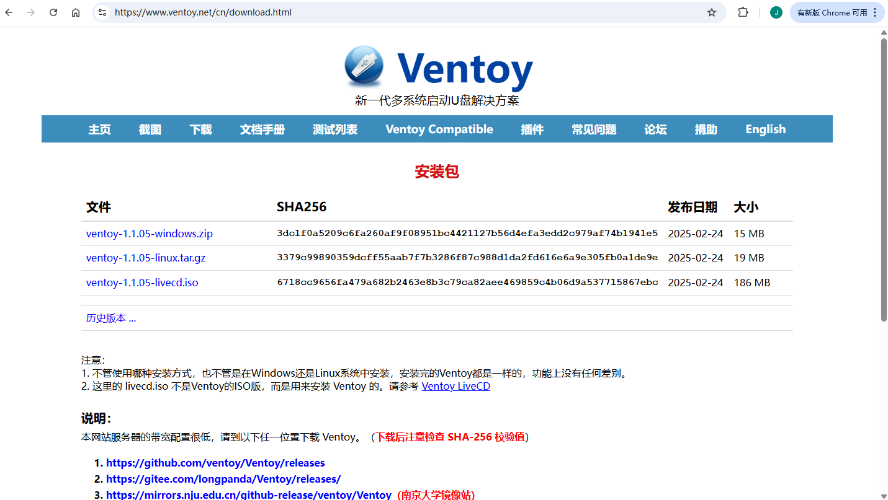
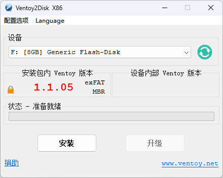

# 安装ESXi 8.0 虚拟机

https://blog.csdn.net/NOWSHUT/article/details/127736684

## 1、下载 Ventoy 制作启动U盘
[官网下载地址](https://www.ventoy.net/cn/download.html)

点击下载对应操作系统安装包，进入 github 下载界面，选择对应版本进行下载即可。

## 2、制作启动盘
* 首先将准备好的U盘格式化
* 打开安装文件夹，双击【Ventoy2Disk.exe】安装执行文件
* 在弹出的界面选择U盘进行安装
  
* 等待安装完成即可。
