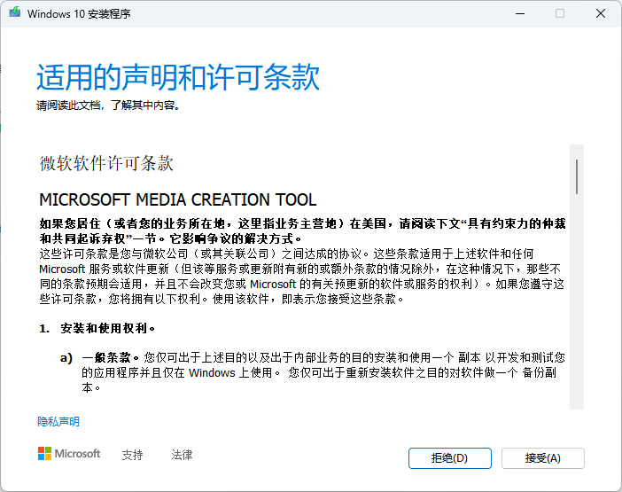
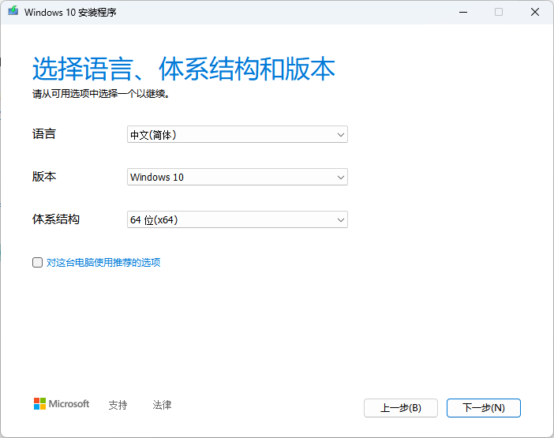
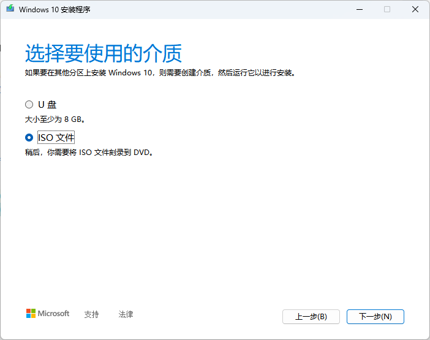
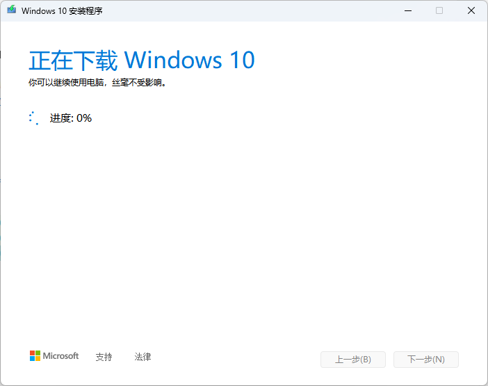
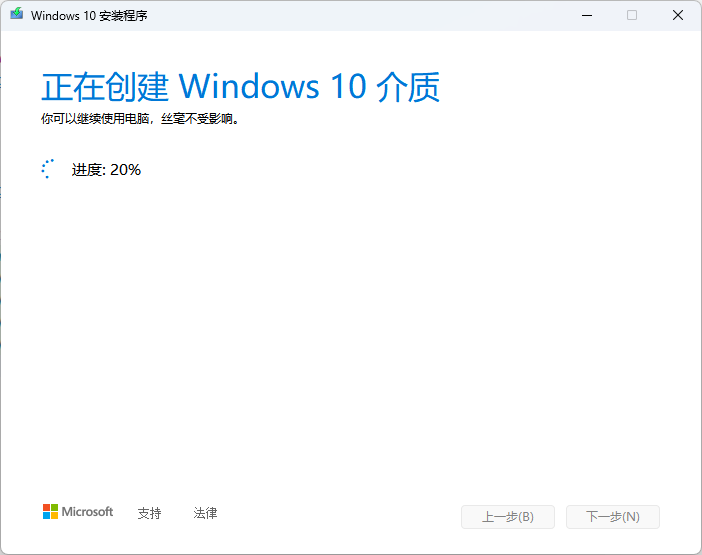
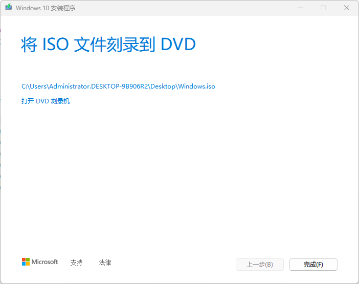

# 镜像下载

## 飞牛 fnOS
前往 [飞牛官网地址](https://www.fnnas.com/) 下载最新的系统安装 iso 镜像。

## 虚拟机格式转换工具 StarWind V2V Converter
[StarWind V2V Converter](https://www.starwindsoftware.com/)


## Openwrt
[openwrt](https://archive.openwrt.org/)
https://blog.csdn.net/lzyaks/article/details/128758020

# 获取 Windows 10 镜像文件








更新软件库
```shell
opkg update
```
下载主题
```shell
# https://github.com/jerrykuku/luci-theme-argon
opkg install luci-compat
opkg install luci-lib-ipkg
wget --no-check-certificate https://github.com/jerrykuku/luci-theme-argon/releases/download/v2.3.2/luci-theme-argon_2.3.2-r20250207_all.ipk
opkg install luci-theme-argon*.ipk
```
安装docker
```shell
opkg install luci-app-dockerman
```

安装动态DNS解析
```shell
# 列出可用 Luci 应用
opkg update && opkg list | grep luci-app
# 安装动态 DNS 管理界面
opkg install luci-app-ddns   
```

安装openCLash
```shell
# 下载
wget https://github.com/vernesong/OpenClash/releases/download/v0.46.014-beta/luci-app-openclash_0.46.014-beta_all.ipk

# 安装
opkg install luci-app-openclash_0.46.014-beta_all.ipk
```
