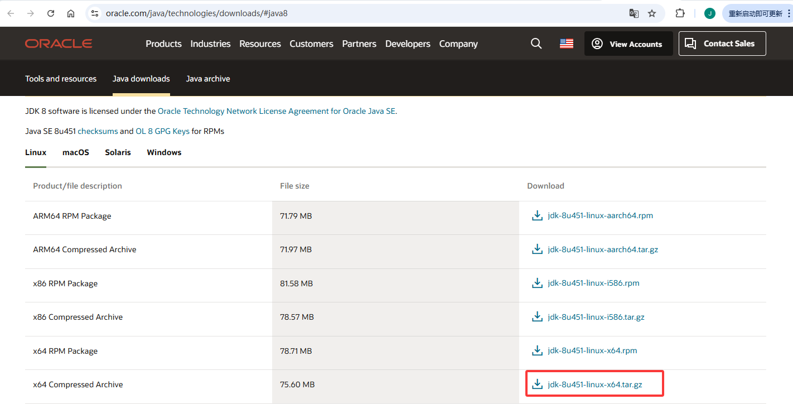

# 安装 Java 环境

## Centos 7 安装 JAVA 环境
### 1、下载安装包
[官网下载地址](http://www.oracle.com/technetwork/java/javase/downloads/jdk8-downloads-2133151.html)

### 2、安装
（1）创建安装目录
```shell
mkdir /usr/local/java/
```
（2）解压至安装目录
```shell
tar -zxvf jdk-8u451-linux-x64.tar.gz -C /usr/local/java/
```
### 3、设置环境变量
（1）打开文件
```shell
vim /etc/profile
```
（2）在末尾添加
```shell
export JAVA_HOME=/usr/local/java/jdk1.8.0_451
export JRE_HOME=${JAVA_HOME}/jre
export CLASSPATH=.:${JAVA_HOME}/lib:${JRE_HOME}/lib
export PATH=${JAVA_HOME}/bin:$PATH
```
（3）使环境变量生效
```shell
source /etc/profile
```
（4）添加软链接
```shell
ln -s /usr/local/java/jdk1.8.0_451/bin/java /usr/bin/java
```
（5）测试
```shell
java -version
```
