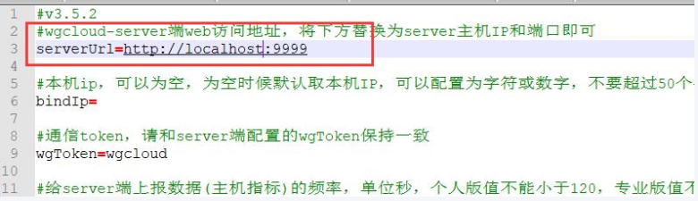
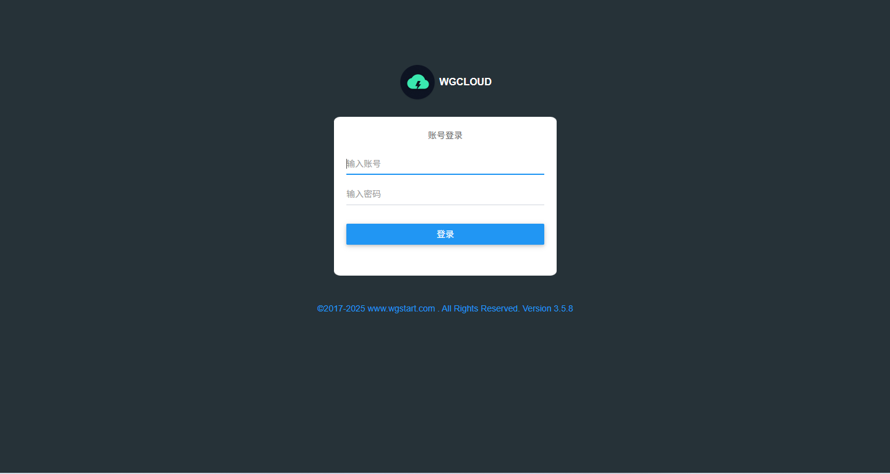

# WGCLOUD监控系统
WGCLOUD包括：server为服务端（或主控端），agent为客户端（探针端、被控端），server和agent可以部署在同一个主机

WGCLOUD的server和agent，可以部署在已有业务运行的主机，不要求主机是纯净的操作系统。当然了，纯净的系统也可以部署WGCLOUD

server端一般只部署一个就行，所有agent向这个server单向上报监控数据
## 部署环境要求
> 1、JDK 环境

server所在主机需要JDK环境（JDK1.8、JDK11都可以），OpenJDK也可以，更高版本JDK也支持，一般推荐使用JDK1.8或JDK11

因server使用java开发，所以server所在主机需要JDK环境，如已安装则跳过

如下命令，检测是否安装JDK，输出类似下面结果，说明已安装。
```shell
[root@VM-0-14-centos ~]# java -version
java version "1.8.0_152"
Java(TM) SE Runtime Environment (build 1.8.0_152-b16)
Java HotSpot(TM) 64-Bit Server VM (build 25.152-b16, mixed mode)
```
> 2、数据库

server需要数据库来存贮数据

支持MySQL、MariaDB、PostgreSQL、Oracle、SQL Server这五种数据库，选择其中任一种作为数据源即可，如果已安装则跳过

也支持国产数据库 PolarDB、openGauss、OceanBase、Kingbase、万里数据库、达梦数据库等，
> 3、Agent

agent所在主机不需要JDK、不需要JDK、不需要JDK
* agent所在主机不需要JDK及其他依赖，解压后可直接启动运行
* agent对linux要求为：内核版本2.6.23或更高，CentOS/RHEL 6.0以上
* agent对windows要求为：Windows Server 2008 R2，2012，2016，2019，2022，Windows 7，Windows 8，Windows 10，Windows 11

不管是server还是agent，都不需要编译，都是解压后，就可以启动运行了，不会污染已有的系统任何功能和文件
## 下载安装包
**Linux平台** (amd64或x86_64，包含server和agent)：[wgcloud-v3.5.8.tar.gz](https://www.wgstart.com/download/3.5.8/wgcloud-v3.5.8.tar.gz) 120M BMD5: 066e1181393285b536527d1411eeff78

**Windows平台** (amd64或x86_64，包含server和agent)：[wgcloud-v3.5.8.zip](https://www.wgstart.com/download/3.5.8/wgcloud-v3.5.8.zip) 120MB

[agent安装包单独下载 (如Windows、Linux、ARM、MAC、MIPS、Android等版本) ](https://www.wgstart.com/help/docs15.html)

[其他说明，如何在ARM系统架构等平台部署server程序 ](https://www.wgstart.com/help/docs60.html)
## 初始化数据库
数据库使用MySQL，版本5.6或以上就可以，MySQL 8也支持，也可以用PostgreSQL和Oracle，SQLServer

创建数据库，名称为<font color="red">**wgcloud**</font>，字符集设置为UTF-8 Unicode即可

导入对应的sql脚本，sql文件在安装包里，解压后可以看到，在sql文件夹下
```shell
# 进入安装包目录  如：/opt/wgcloud/
tar -zxvf wgcloud-v3.5.8.tar.gz

# sql文件
/opt/wgcloud/wgcloud-v3.5.8/sql/
```
根据对应数据库执行SQL文件，完成数据表初始化。

## 启动Server
> 1、修改项目数据库连接信息

文件位置 /opt/wgcloud/wgcloud-v3.5.8/server/config/application.yml
> 2、启动 server

注意：Linux检查下面红框内的文件是否有可执行权限，若无，则赋给可执行权限

./start.sh启动服务，./stop.sh停止服务
```shell
# 进入 server 目录
cd /opt/wgcloud/wgcloud-v3.5.8/server


# 执行启动命令
./start.sh
# 输出以下日志
./wgcloud-server-release.jar
wgcloud-server程序开始启动

./wgcloud-daemon-release
wgcloud-daemon程序开始启动

```
> 3、启动 agent

* 修改配置文件

注意，/opt/wgcloud/wgcloud-v3.5.8/agent/config/application.properties的serverUrl需要改成server主机的IP和端口


注意：Linux检查下面红框内的文件是否有可执行权限，若无，则赋给可执行权限

./start.sh启动服务，./stop.sh停止服务

* 启动
```shell
# 进入agent目录
cd /opt/wgcloud/wgcloud-v3.5.8/agent

# 启动
./start.sh
# 输出以下日志
./wgcloud-agent-release
wgcloud-agent程序开始启动

```
## 访问
访问地址：[http://127.0.0.1:9999](http://127.0.0.1:9999)

默认登录账号密码：admin/111111

最后，要注意把server主机的9999要开放给agent主机访问，使agent主机能telnet通9999即可



## 参考文档
[项目文档](https://www.wgstart.com/docs13.html)
