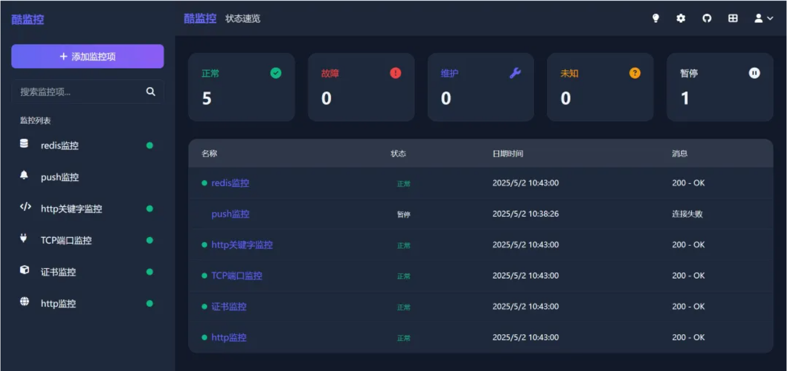

# 高颜值的监控工具Coolmonitor


## 什么是酷监控（ Coolmonitor ）？
> 酷监控（Coolmonitor ）是一个高颜值的监控工具，支持网站监控、接口监控和 HTTPS 证书监控等多种功能，帮助开发者及运维人员实时掌握网站/接口运行状态。本项目支持 Docker 一键快速部署，拥有美观现代的界面设计。

## 主要特点
* **多种监控类型:** 支持 HTTP/HTTPS 网站、API 接口、HTTPS 证书、TCP 端口、MySQL/Redis 数据库等。
* **推送监控:** 支持接收客户端的心跳推送，实现不可直接访问设备的监控。
* **精美界面:** 深色/浅色主题切换，响应式设计，适配各种设备。
* **强大通知系统:** 支持邮件、Webhook 和微信等多种通知方式。
* **数据可视化:** 提供直观的状态图表和分析功能，快速了解系统运行状况。
* **持久化存储:** 使用 SQLite 数据库，轻量级部署，无需额外依赖。


## 应用场景
* <font color="red"><b>网站监控:</b></font> 确保网站的可用性和响应时间，及时发现异常。
* <font color="red"><b>接口监控:</b></font> 监测 API 的稳定性和性能，确保服务持续可用。
* <font color="red"><b>证书监控:</b></font> 提前预警 HTTPS 证书过期，防止服务中断。
* <font color="red"><b>数据库监控:</b></font> 监控 MySQL 和 Redis 数据库的健康状况，确保数据服务正常。




## 安装
本文以 Docker Compose 方式部署

第一步：创建存放数据库和设置文件的数据目录
```shell
mkdir /data/coolmonitor/data
```
第二步：创建 docker-compose.yml 文件
```shell
# 进入安装目录
cd /data/coolmonitor
# 创建配置文件
touch docker-compose.yml
```
docker-compose.yml 文件内容如下：
```yaml
version: '3'

services:
  coolmonitor:
    image: star7th/coolmonitor:latest
    container_name: coolmonitor
    restart: unless-stopped
    ports:
      - 3333:3333
    volumes:
      - /data/coolmonitor/data:/app/data
```
<font color="red"><b>注意端口是否冲突问题。</b></font>

第三步：启动项目
```shell
# 进入 /data/coolmonitor 目录
docker-compose up -d
```
第四步：运行
在浏览器中输入 [http://127.0.0.1:3333](http://127.0.0.1:3333)。
第一次会显示管理员设置界面，输入需要设置的管理员账号和密码即可，设置完成后，会进入主界面。


**Coolmonitor 支持的监控类型**
* <font color="red"><b>HTTP/HTTPS网站监控：</b></font>检查网站可用性和响应时间
* <font color="red"><b>HTTPS证书监控：</b></font>检查 SSL 证书过期时间，提前预警
* <font color="red"><b>关键词监控：</b></font>检查网页内容是否包含特定关键词
* <font color="red"><b>TCP端口监控：</b></font>检查端口是否开放
* <font color="red"><b>MySQL/MariaDB数据库监控：</b></font>检查数据库连接和基本查询
## 参考文档
[文档地址](https://github.com/star7th/coolmonitor)
